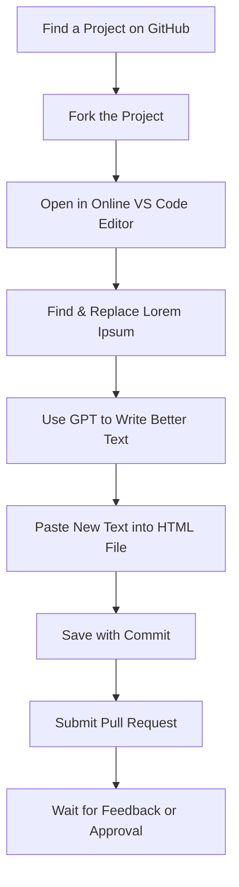

# 🌟 XpressLab Beginner Guide (No Coding, No Problem!)

Welcome to **XpressLab** – a place where you can learn, grow, and contribute to real projects, even if you don’t know how to code.

This guide is for **complete beginners**. We’ll help you step by step.

---

## 🛠️ What Tools Will You Use?

| Tool | What It Does | Link |
|------|--------------|------|
| GitHub | A place where people store code and content | [Visit GitHub](https://github.com) |
| GitHub Desktop | Makes GitHub easy on your computer | [Download GitHub Desktop](https://desktop.github.com) |
| VS Code | A simple editor where you can change text | [Download VS Code](https://code.visualstudio.com) |
| Live Server | Lets you see website changes live | [Install Live Server](https://marketplace.visualstudio.com/items?itemName=ritwickdey.LiveServer) |
| ChatGPT or Copilot | Helps you rewrite "Lorem Ipsum" into real content | [Use ChatGPT](https://chat.openai.com) |

---

## 🧹 Step 1: Clean Your Workspace

Before we begin:

1. Close all apps and tabs.
2. Open your browser (like Chrome).
3. Open **two tabs**:
   - One for this guide
   - One for GitHub

---

## 🔍 Step 2: Find a Project

Click any link below to find a project that needs help:

| Organization | What They Do | Link |
|--------------|--------------|------|
| World Enterprise | Websites and Marketing | [Open](https://github.com/worldenterprisegroup?tab=repositories) |
| Note Hive | Writing, Guides, Handbooks | [Open](https://github.com/Note-Hive?tab=repositories) |
| United Home | Home & Lifestyle Projects | [Open](https://github.com/United-Home?tab=repositories) |
| Tao Learning | Education Projects | [Open](https://github.com/TaoLearning?tab=repositories) |


---
## 🍴 Step 3: Fork the Project

When you find a project you want to work on , you need to make your own copy of it. This is called **"forking"** the project.

Here’s how to do it:

---

### 📝 Steps to Fork:

1. Go to the top-right corner of the project’s GitHub page.
2. Click the **Fork** button.

---

### 🛠️ Name Your Fork:

- GitHub will ask you to **choose a name** for your forked project.
- If you have **never forked this project before**, you can leave the default name.
- If you **already have a fork with the same name**, you must **change the name** (for example: `projectname-v2`).

---

### 🌿 Select the Correct Branch (`gh-pages`):

- Before creating the fork, look for a dropdown that lets you **choose the branch to fork**.
- Always select the **`gh-pages`** branch (not `main` or any other branch).
  - This is the branch where the website files usually live.
- If you don’t see a branch option, don’t worry — you can switch to `gh-pages` after the fork is created.
- After naming and selecting the branch (`gh-pages`), click **Create Fork**.
- GitHub will now make a copy of the project under your account.

---

## 💻 Step 4: Open the Project in VS Code (Online)

1. On your forked GitHub project page, press the **"." (dot)** key on your keyboard.
2. This will open the project in GitHub’s online editor.

---

## 🔥 Step 5: Install Live Server (Optional)

If you want to preview changes live:

1. Install **VS Code** on your computer: [Download here](https://code.visualstudio.com)
2. In VS Code, click the **Extensions** icon (4 squares)
3. Search for **Live Server**
4. Click **Install**
5. Open your HTML file → **Right-click → “Open with Live Server”**

---

## ✍️ Step 6: Replace the Text Using GPT

If you see this in an HTML file:

```html
<p>Lorem ipsum dolor sit amet, consectetur adipiscing elit.</p>
```

You need to replace it with real text using AI.

### 🧠 Sample Prompt for GPT:

```text
I am editing a website. Replace this text with real marketing content:
"Lorem ipsum dolor sit amet, consectetur adipiscing elit."
Use friendly, clear English. Make it short and professional.
```

- Copy the response from GPT
- Paste it into your HTML file, replacing the placeholder text

---

## 💾 Step 7: Save Your Changes

In the GitHub online editor (or VS Code):

1. Click the **Source Control** icon (looks like a branch)
2. Type a message like:  
   `Updated homepage content - replaced Lorem Ipsum`
3. Click ✔️ (Commit)

---

Sure! Here's the **updated Step 8** written in full **Markdown format**, ready to copy and paste into your `beginner-guide.md` or `README.md` file.

---
## 🔁 Step 8: Submit a Pull Request (PR)

Now it’s time to send your changes back to the main project so they can be reviewed and possibly added.

Follow these steps carefully:

---

### ✅ What is a Pull Request (PR)?

A **Pull Request** is how you ask the original project owners to include the changes you made in your copy (fork) of the project.

---

### 🧭 How to Submit Your Pull Request:

1. Go to your forked project on **GitHub** (your version of the project).
2. On the top of the page, click the **"Pull Requests"** tab.
3. Click the green button that says **"New Pull Request."**

---

### 🔁 Choose the Right Branches:

When creating a pull request, GitHub asks you to **compare two branches**:

| Option | What to Choose |
|--------|----------------|
| **Base branch (main project)** | Choose `gh-pages` (this is where your changes will go) |
| **Head branch (your fork)** | Choose the branch where you made the changes (usually `gh-pages` if you followed this guide) |

> ⚠️ **Important:**  
> Always make sure that the **base branch is `gh-pages`**.  
> If you select `main` or another branch by mistake, the project owner may not accept your changes.

---

### 📝 Write a Short Description:

In the message box, explain what you changed. Keep it short and clear. For example:

```
✅ Replaced Lorem Ipsum text on the homepage with real marketing content.
🚀 Edited the "about.html" file and added friendly, clear text.
```

---

### 📤 Submit!

Click the **"Create Pull Request"** button.

🎉 That’s it! You’ve just sent your changes for review.

---

### 🔍 What Happens Next?

- The project team will review your changes.
- They may approve it, ask for changes, or give you helpful feedback.
- Once approved, your changes become part of the live project!

---

### 💡 Tip:

If you're ever unsure which branch to choose, just remember:

- **Base branch** → `gh-pages` (this is the final destination)
- **Head branch** → your own branch (where you made the edits)

## ✅ You Did It!

🎉 Congratulations! You just contributed to a real project!

Your work will be reviewed. You may receive feedback or approval soon.

---

## 📚 Want to Learn More?

- Learn GitHub Skills: [GitHub Skills](https://skills.github.com)
- Join the community: [Curiosity Hive](https://curiosityhive.org)

---

## 💰 Want to Get Paid?

If your contribution is very helpful, you may get paid!

1. Add your **USDT Wallet Address** to your GitHub Profile Bio
2. Learn how to do that: [Where to find my Wallet Address](https://www.followchain.org/binance-wallet-address)
3. See an example: [Sample Profile](https://github.com/yennefer-m)

---

## 📘 Glossary (Easy Terms)

| Word | Meaning |
|------|--------|
| GitHub | A place to share and edit project files |
| Fork | Make your own copy of a project |
| Commit | Save your changes |
| Pull Request | Ask to add your changes to the main project |
| Lorem Ipsum | Fake text that needs to be replaced |
| GPT | Smart AI that helps you write content |

---

## 🧩 Visual Overview



---

## 💡 Final Tip

Don’t be afraid to ask questions. You are learning real skills and helping real projects.

**You belong here. You are doing great. Keep going!** 💪

---
