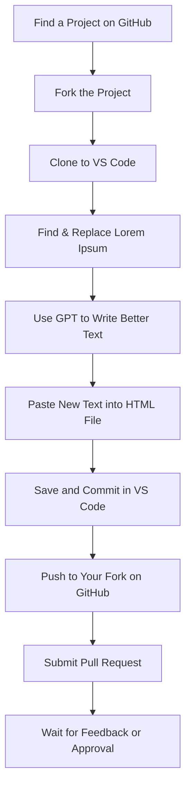

# 🌟 XpressLab Beginner Guide (No Coding, No Problem!)

Welcome to **XpressLab** – a place where you can learn, grow, and contribute to real projects, even if you don’t know how to code.

This guide is for **complete beginners**. We’ll help you step by step.

---

## 🛠️ What Tools Will You Use?

| Tool         | What It Does                                                | Link                                                                                                             |
|--------------|------------------------------------------------------------|------------------------------------------------------------------------------------------------------------------|
| GitHub       | A place where people store code and content                | [Visit GitHub](https://github.com)                                                                               |
| Git          | The tool to download project files from GitHub to your computer | [Download Git](https://git-scm.com/downloads)                                                                |
| VS Code      | A simple editor where you can change text                  | [Download VS Code](https://code.visualstudio.com)                                                                |
| Live Server  | Lets you see website changes live                          | [Install Live Server](https://marketplace.visualstudio.com/items?itemName=ritwickdey.LiveServer)                 |
| ChatGPT or Copilot | Helps you rewrite "Lorem Ipsum" into real content    | [Use ChatGPT](https://chat.openai.com)                                                                           |

---

## 🧹 Step 1: Clean Your Workspace

Before we begin:

1. Close all apps and tabs.
2. Open your browser (like Chrome).
3. Open **two tabs**:
   - One for this guide
   - One for GitHub

---

## 🔍 Step 2: Find a Project

Click any link below to find a project that needs help:

| Organization         | What They Do                                                                                 | Link                                                                                           |
|----------------------|---------------------------------------------------------------------------------------------|------------------------------------------------------------------------------------------------|
| World Enterprise     | Graphics, Copywriting, & Website Design for Startups                                        | [Open](https://github.com/worldenterprisegroup?tab=repositories)                               |
| Note Hive            | Documentation, Grants, Guides, Handbooks, and Writing Projects                              | [Open](https://github.com/Note-Hive?tab=repositories)                                          |
| United Home          | Home, Lifestyle, and Architectural Projects                                                 | [Open](https://github.com/United-Home?tab=repositories)                                        |
| HardMagic            | Design, Ideation, Storytelling, Branding, Visionary, Futurism, Creative Direction           | [Open](https://github.com/HardMagic?tab=repositories)                                          |
| Tao Learning Institute | Non-Profit Organization focused on STEAM Literacy, Learning, & Development                | [Open](https://github.com/TaoLearning?tab=repositories)                                        |
| INSTAR Lab Inc       | Scientific Research Institute with projects in Quantum Research, AI, and Future of Work     | [Open](https://github.com/INSTARLab?tab=repositories)                                          |
| Source Now           | Data Science, Data Analysis, Forensics, Data Research                                       | [Open](https://github.com/Source-Now?tab=repositories)                                         |
| SILK Corp            | Public Benefit Corporation focused on Women Empowerment, DE&I, Homesteading, Health & Wellness Industry | [Open](https://github.com/WorldEnterpriseGroup?tab=repositories&q=silkcorp&type=&language=&sort=) |
| SILK Corp Guide      | SILK Corp Franchise Model                                                                   | [Open](https://github.com/NoteHive/Silk-Corp-Guide)                                            |
| Curiosity Corp       | Nonprofit organization dedicated to advancing innovative education and workforce training    | [Open](https://github.com/Curiosity-Corp)                                                      |

---

## 🍴 Step 3: Fork the Project

When you find a project you want to work on, you need to make your own copy. This is called **"forking"** the project.

### 📝 How to Fork:

1. Go to the project’s GitHub page.
2. Click the **Fork** button (top right).
3. **Name your fork** if you want, or leave it as is.
4. **Select the `gh-pages` branch** if you see a branch dropdown, otherwise you can switch later.
5. Click **Create Fork**.  
   GitHub will make a copy of the project under your account.

---

## 💻 Step 4: Download the Project to VS Code (on Your Computer)

You will need to **download Git** and **VS Code** if you haven’t already:

- [Download Git](https://git-scm.com/downloads)
- [Download VS Code](https://code.visualstudio.com)

### How to Get the Project on Your Computer

1. Go to **your forked project** on GitHub.
2. Click the green **Code** button, then copy the **HTTPS** link.
3. Open **VS Code**.
4. Press <kbd>Ctrl</kbd>+<kbd>Shift</kbd>+<kbd>P</kbd> (or <kbd>Cmd</kbd>+<kbd>Shift</kbd>+<kbd>P</kbd> on Mac).
5. Type **Git: Clone** and select it.
6. **Paste** the link you copied.
7. Choose a folder on your computer where you want the project to be downloaded.
8. When done, **VS Code will ask if you want to open the project**. Click **Open**.

> **Tip:**  
> This step uses only one Git command (`git clone`), and VS Code helps with the rest!

---

## 🔥 Step 5: Install Live Server

If you want to preview website changes live:

1. In VS Code, click the **Extensions** icon (4 squares on the left).
2. Search for **Live Server**.
3. Click **Install**.
4. Open your HTML file → **Right-click → “Open with Live Server”**.

---

## ✍️ Step 6: Replace the Text Using GPT

If you see something like this in an HTML file:

```html
<p>Lorem ipsum dolor sit amet, consectetur adipiscing elit.</p>
```

Replace it with real text using AI.

### 🧠 Sample Prompt for GPT:

```
I am editing a website. Replace this text with real marketing content:
"Lorem ipsum dolor sit amet, consectetur adipiscing elit."
Use friendly, clear English. Make it short and professional.
```

- Copy the response from GPT
- Paste it into your HTML file, replacing the placeholder text

---

## 💾 Step 7: Save and Commit Your Changes in VS Code

1. In VS Code, find the **Source Control** icon on the left (looks like a branch).
2. Enter a short message (example:  
   `Updated homepage content - replaced Lorem Ipsum`)
3. Click the ✔️ **Commit** button.

> **No command line needed! VS Code will do it for you.**

---

## 🔁 Step 8: Push and Submit Your Changes to GitHub

1. After you commit, click the **Sync Changes** button (or "Push" button) at the top of the Source Control panel in VS Code.
2. Your changes will upload directly to **your forked repository** on GitHub.

---

## 🚀 Step 9: Submit a Pull Request (PR)

Now send your changes back to the main project:

1. Go to **your forked project** on GitHub.
2. Click the **"Pull Requests"** tab.
3. Click **"New Pull Request"**.
4. Make sure:
   - **Base branch** (main project): `gh-pages`
   - **Head branch** (your fork): the branch you changed (usually `gh-pages`)
5. Write a short description of what you changed.
6. Click **"Create Pull Request"**.

---

### What Happens Next?

- The project team will review your changes.
- They might approve it, ask for changes, or give you feedback.
- Once approved, your content becomes part of the live website!

---

## 📚 Want to Learn More?

- Learn GitHub Skills: [GitHub Skills](https://skills.github.com)
- Join the community: [Curiosity Hive](https://curiosityhive.org)

---

## 💰 Want to Get Paid?

If your contribution is very helpful, you may get paid!

1. Add your **USDT Wallet Address** to your GitHub Profile Bio
2. Learn how to do that: [Where to find my Wallet Address](https://www.followchain.org/binance-wallet-address)
3. See an example: [Sample Profile](https://github.com/yennefer-m)

---

## 📘 Glossary (Easy Terms)

| Word        | Meaning                                         |
|-------------|-------------------------------------------------|
| GitHub      | A place to share and edit project files         |
| Fork        | Make your own copy of a project                 |
| Commit      | Save your changes                               |
| Pull Request| Ask to add your changes to the main project     |
| Lorem Ipsum | Fake text that needs to be replaced             |
| GPT         | Smart AI that helps you write content           |

---

## 🧩 Visual Overview



---


## 📖 Learn Git & GitHub (Free Courses)

Want to build your skills? Here are some beginner-friendly, step-by-step courses and tutorials:

| Title & Platform | Description | Link |
|------------------|-------------|------|
| **Introduction to GitHub** (GitHub Skills) | Hands-on, interactive course made by GitHub. Learn how to use repositories, branches, commits, and pull requests. | [Start Course](https://skills.github.com/) |
| **GitHub for Beginners** (freeCodeCamp YouTube) | Full video course for total beginners. Perfect for understanding repositories, commits, branches, and pull requests. | [Watch on YouTube](https://www.youtube.com/watch?v=RGOj5yH7evk) |
| **Git Started with GitHub** (Codecademy) | Interactive, beginner-friendly modules to help you understand Git and GitHub basics. | [Try Codecademy](https://www.codecademy.com/learn/learn-git) |
| **Git and GitHub for Beginners** (Coursera, Free Audit) | University of California, Davis: Basic course, free if you choose "Audit". | [View on Coursera](https://www.coursera.org/learn/introduction-git-github) |
| **Hello World: GitHub Guide** (GitHub Docs) | Written guide with screenshots for your first GitHub project. | [Read Guide](https://docs.github.com/en/get-started/quickstart/hello-world) |

---

You can also explore the [GitHub Learning Lab](https://lab.github.com/) for more hands-on tutorials.


---


## 💡 Final Tip

Don’t be afraid to ask questions. You are learning real skills and helping real projects.

**You belong here. You are doing great. Keep going!** 💪

---

**Now you can update any website project from your own computer using just VS Code and one simple `git clone`!**
```

---

